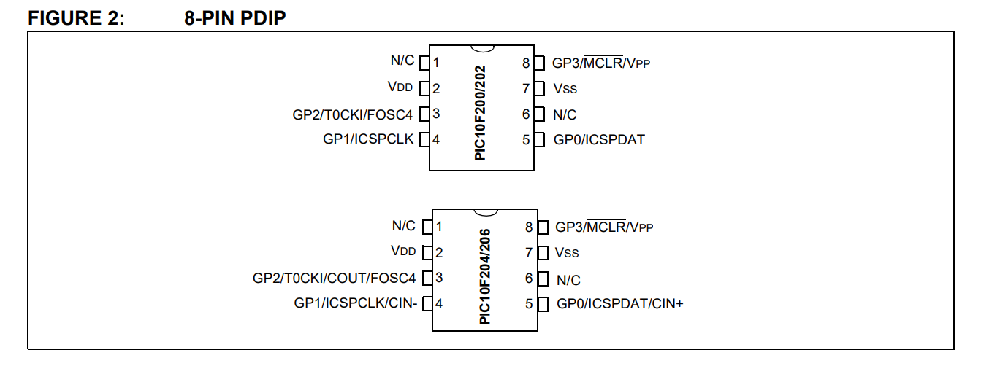
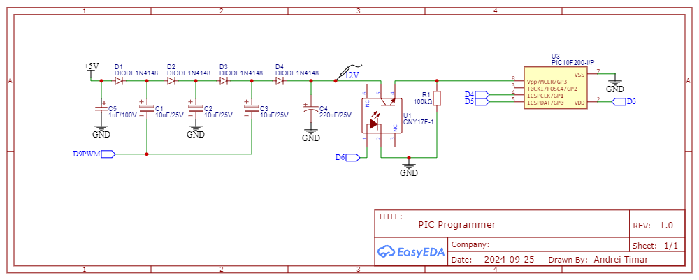

# PIC Programmer

---

## Programmer

A simple PIC Programmer made for Arduino

#### Circuit Diagram

#### Arduino

- PIN D6 -> VPP
- PIN D3 -> VDD
- PIN D4 -> ICSPCLK
- PIN D5 -> ICSPDAT
- PIN D9 -> PWM for the 12V charge pump

#### PIC10F200 Pinout



#### Schematic



#### Datasheets

- [PIC10F200 Datasheet](https://ww1.microchip.com/downloads/en/DeviceDoc/40001239F.pdf)
- [PIC10F200 Memory Programming Specification](https://ww1.microchip.com/downloads/en/DeviceDoc/41228C.pdf)
- [CNY17F-1 Optocoupler](https://ro.mouser.com/datasheet/2/239/CNY17F_SERIES_1115-1903833.pdf)

### Build Instructions

1. Install prerequisites as described in the [`avr-hal` README] (`avr-gcc`, `avr-libc`, `avrdude`, [`ravedude`]).

2. Run `cargo build` to build the firmware.

3. Run `cargo run` to flash the firmware to a connected board. If `ravedude`
   fails to detect your board, check its documentation at
   <https://crates.io/crates/ravedude>.

4. `ravedude` will open a console session after flashing where you can interact with the UART console of your board.

[`avr-hal` README]: https://github.com/Rahix/avr-hal#readme

[`ravedude`]: https://crates.io/crates/ravedude

### Resources

- [DIYODE - Arduino based PIC Programmer](https://diyodemag.com/projects/arduino_pic_programmer)
- [Charge Pump Circuit - Getting Higher Voltage from Low Voltage Source](https://circuitdigest.com/electronic-circuits/charge-pump-circuit-design)

---

## PIC Programmer CLI

A simple cli app that connects to an Arduino and send the contents of a hex file to program a PIC Microcontroller

### Programming protocol

- Wait for the message `Programmer ready!`
- send `P` to start programming
- wait for message `start`
- read lines from input file and send them one by one until end of file
- read message from programmer
- wait for `done`

Each line of the hex file is sent until the end of file or `end of file instruction` (:00000001FF).

After each line, the programmer will send either `Y` if the instruction was read successfully with the checksum
verification or `R` if the last instruction needs to be resent

### Reading stored program protocol

- Wait for the message `Programmer ready!`
- send `D` to start programming
- wait for message `start`
- read lines from programmer
- wait for `done`

### CLI Commands

#### List Ports

```shell
pic-programmer-cli.exe list-ports
```

#### Program

```shell
pic-programmer-cli.exe program -i "file.hex" -p COM5
```

##### Arguments

- `-i` or `--input-file-path` - File path to hex file that needs to be programmed.
- `-p` or `--port-name` - Port name to use (e.g., COM3).
- `-b` or `--baud-rate` - Baud rate for the connection. [default: 57600]
- `-t` or `--timeout` - Serial port connection timeout in milliseconds. [default: 5000]
- `-v` or `--verbose` - Prints more content. [default: false]

#### Print Program

```shell
pic-programmer-cli.exe program -p COM5
```

##### Arguments

- `-p` or `--port-name` - Port name to use (e.g., COM3).
- `-b` or `--baud-rate` - Baud rate for the connection. [default: 57600]
- `-t` or `--timeout` - Serial port connection timeout in milliseconds. [default: 5000]
- `-v` or `--verbose` - Prints more content. [default: false]

---

## PIC Assembler

### Command line Options

- `InputFilePath` - Input path to assembly file
- `-c` - Path to config file
- `-o` - Output path to output hex file. Default value: `output.hex`
- `--debug`- Write to output file in the following format: `address opcode`

```shell
.\PicAssembler.exe file.asm -c PIC10F200.json -o output_file.asm
```

### Build Project

```shell
dotnet publish -r win-x64
```
