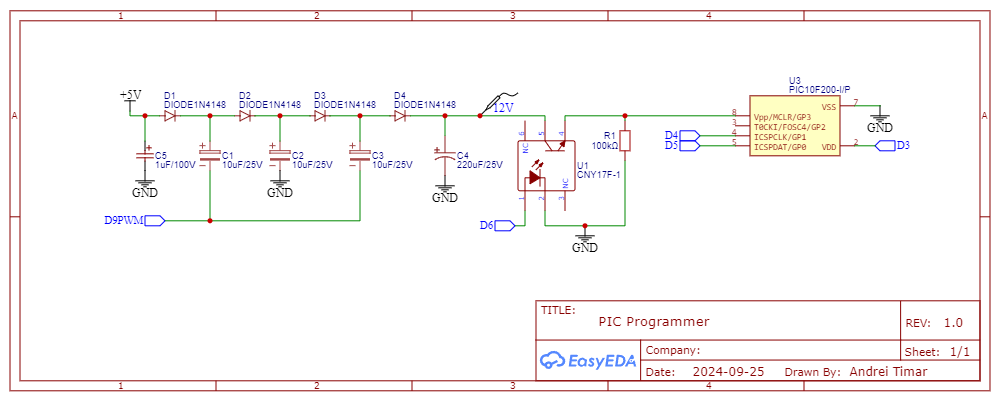

# PIC Programmer

A simple PIC Programmer made for Arduino

### Circuit Diagram

### Arduino

- PIN D6 -> VPP
- PIN D3 -> VDD
- PIN D4 -> ICSPCLK
- PIN D5 -> ICSPDAT
- PIN D9 -> PWM for the 12V charge pump

### PIC10F200 Pinout

### Schematic

### Datasheets

- [PIC10F200 Datasheet](https://ww1.microchip.com/downloads/en/DeviceDoc/40001239F.pdf)
- [PIC10F200 Memory Programming Specification](https://ww1.microchip.com/downloads/en/DeviceDoc/41228C.pdf)
- [CNY17F-1 Optocoupler](https://ro.mouser.com/datasheet/2/239/CNY17F_SERIES_1115-1903833.pdf)

## Build Instructions

1. Install prerequisites as described in the [`avr-hal` README] (`avr-gcc`, `avr-libc`, `avrdude`, [`ravedude`]).

2. Run `cargo build` to build the firmware.

3. Run `cargo run` to flash the firmware to a connected board. If `ravedude`
   fails to detect your board, check its documentation at
   <https://crates.io/crates/ravedude>.

4. `ravedude` will open a console session after flashing where you can interact
   with the UART console of your board.

[`avr-hal` README]: https://github.com/Rahix/avr-hal#readme

[`ravedude`]: https://crates.io/crates/ravedude

## Resources

- [DIYODE - Arduino based PIC Programmer](https://diyodemag.com/projects/arduino_pic_programmer)
- [Charge Pump Circuit - Getting Higher Voltage from Low Voltage Source](https://circuitdigest.com/electronic-circuits/charge-pump-circuit-design)
